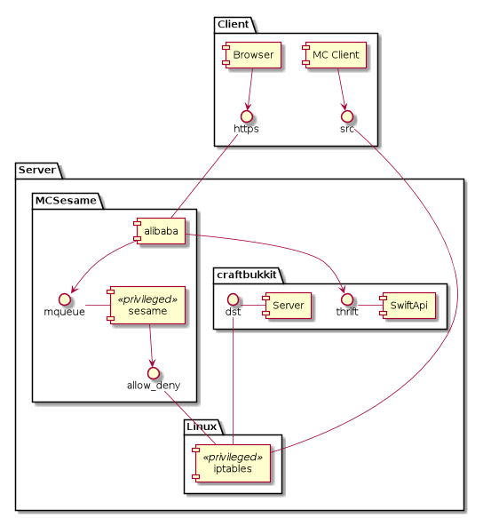

# MC Sesame
Protecting a public Minecraft server by requiring authentication through web-interface.

## What does it do?

It is assumed that by default access to all ports on the server is denied by IPTables. 
Thus, when a MCServer is run, it's port will not be accessible from outside. 

MCSesame has two daemons. ``sesame`` which adds or removes IP addresses to the IPTables
for player machines who authenticated through a web frontend provided by ``alibaba`` daemon.

Also ``alibaba`` will talk to the MCServer via SwiftApi to add the Minecraft user to the
whitelist of the MCServer and remove them when logged out. For players once the port was 
opened, ``alibaba`` monitors their state (still playing) within the MCServer, and if they 
are no longer active, their IP will be removed from IPTables and their Minecraft user will 
be removed from the whitelist. 

User with the ``admin`` flag are allowed to add/remove/change users via the web frontend. 
Furthermore, users with ``admin`` flag will be made Ops in the MCServer.

## Component Diagram

The figure below shows the main components of MC Sesame:

Since changing IPTables needs root rights, but it is not a a good idea (in terms of security)
to run the web serving part (alibaba) with root rights, MC Sesame needs a second daemon, ``sesame``.
Its only purpose is to listen via posix IPC message queue to commands from ``alibaba`` and add or 
remove an IP from/to the IPTables. 

## Prerequisites

The ``openssl`` command is needed to create the SSL devcert. On Ubuntu/Debian it could
be added with:

    sudo apt install openssl

Also a [craftbukkit](https://getbukkit.org/craftbukkit) server with 
[SwiftApi](https://dev.bukkit.org/projects/swiftapi) (v1.7) plugin running 
on the same machine as MCSesame is needed.

## Install System Wide
    
First, install dependencies from ``requirements.txt``:

    sudo pip install -r requirements.txt

Next, install the MCSesame Python modules:

    sudo python setup.py install
    
The install will also create a SSL devcert and a basic configuration and user DB under
``/etc/mcsesame``.

### Start the Daemons

First start the ``alibaba`` daemon with:

    sudo alibaba --user $USER
    
The ``alibaba`` daemon needs to be started as root, but after it accessed all the needed
files, it will drop privileges to the user given with ``--user``.

Note, that a logfile is written to ``/var/log/alibaba.log``.

Next, start the ``sesame`` daemon with:

    sudo sesame

Again, a log file is written to ``/var/log/sesame.log``.
    
Now, you could access the Alibaba webpage with the followin URL:
    
    https://<hostname>:8088/
    
The default login is ``admin`` with password ``admin``.

Note: since we use only a SSL devcert, the browser will complain about
the cert and you need to ignore this warning.

To stop the daemons use:

    sudo sesame -c stop
    sudo alibaba -c stop

## Install in a Virtual Environment

To use a virtual environment, ``virualenv`` has to be install. For details 
see this [guide](http://docs.python-guide.org/en/latest/dev/virtualenvs/). 
In brief, it could be done by:

    sudo pip install virtualenv

Then, a virtual environment with all dependencies could be installed like this:

    sudo ./mkvenv.sh /opt/mcsesame-venv
    
Since the daemons need to be run as root, we need to activate the environment in
a root shell:
    
    sudo su
    source /opt/mcsesame-venv/bin/activate
    
Now install MCSesame into that environment:

    python setup.py install

Launch the daemons as described above for the system wide installation. 
